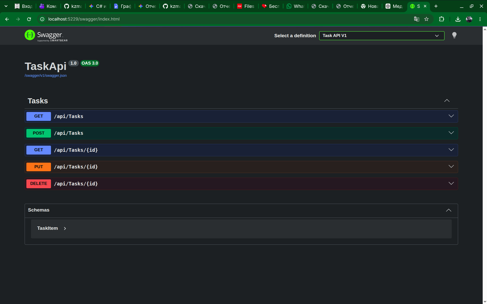
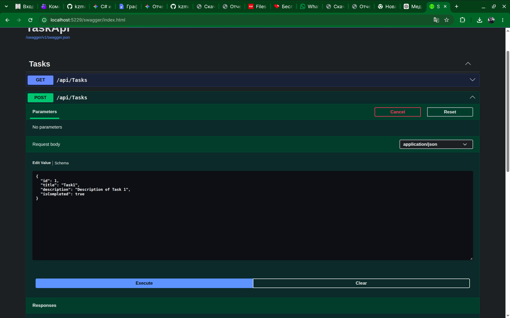
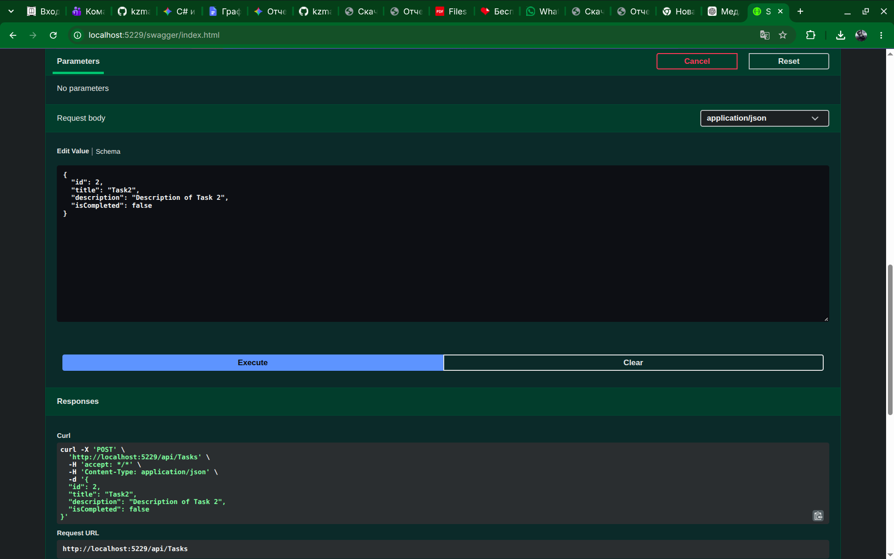
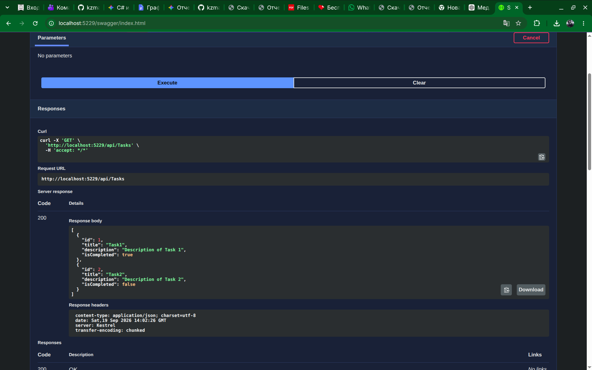
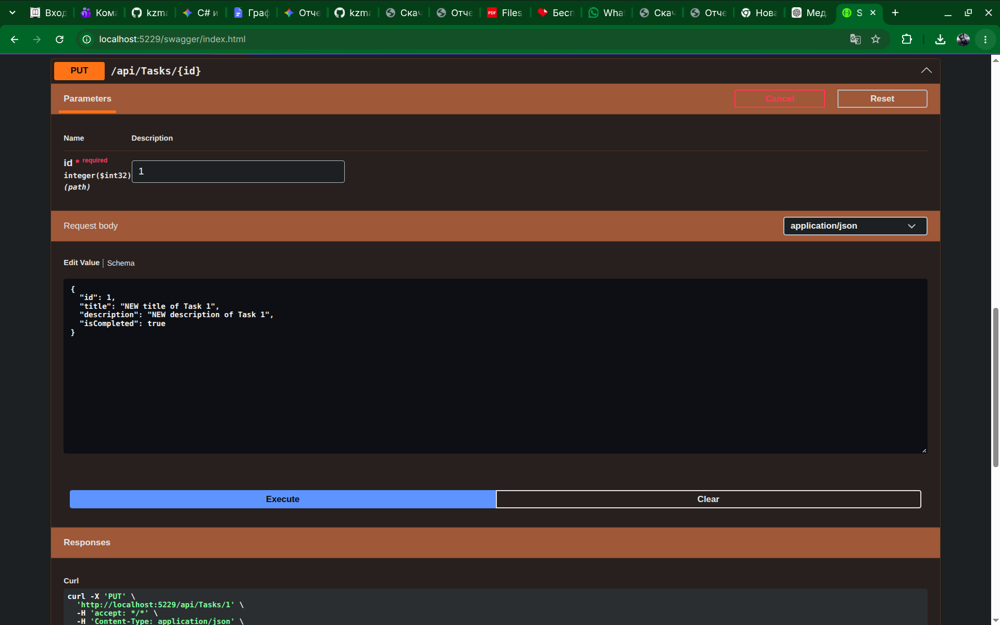
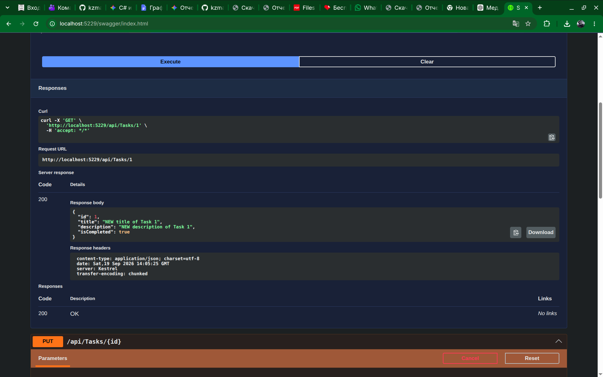
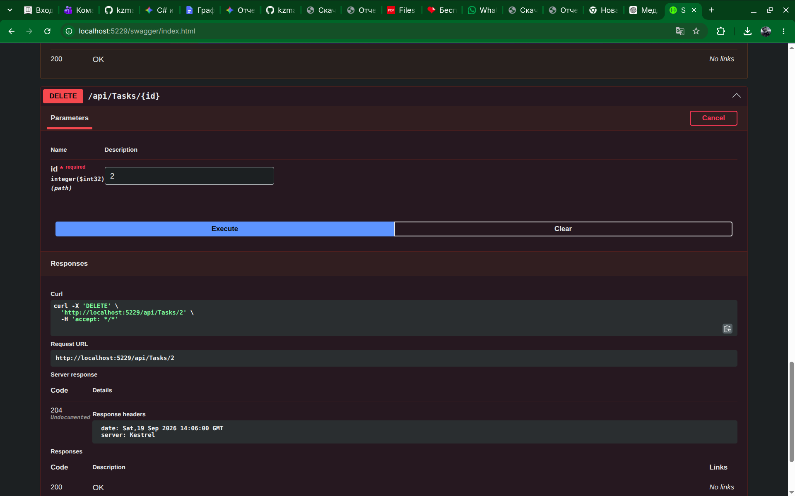
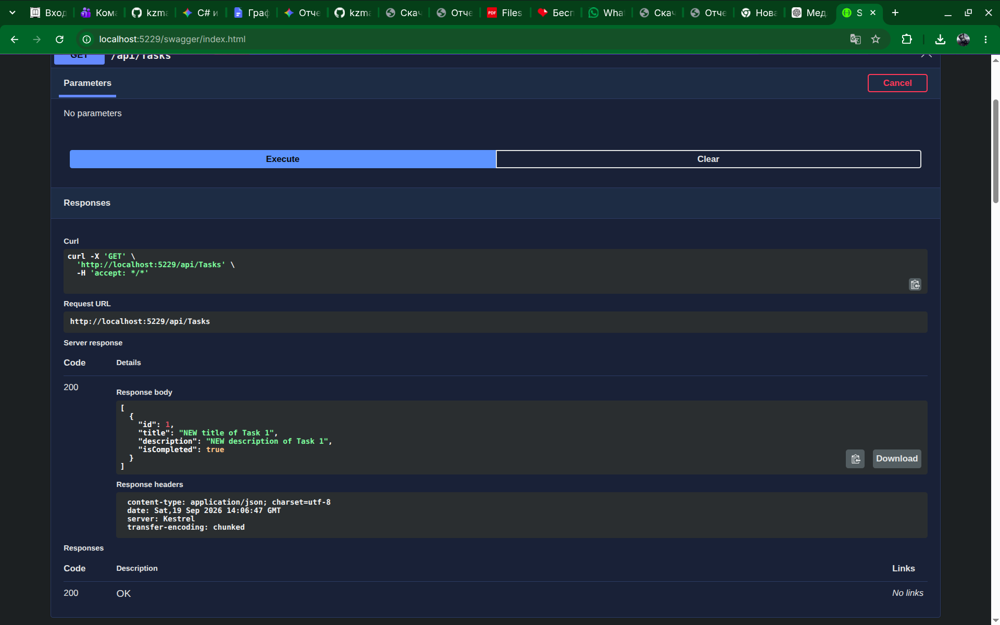

# Ткачев Максим

# Лаборатоная работа 1 

### swagger:

### метод post:

### еще добавление методом post:

### метод get после post:

### метод getById:

### метод put:

### метод get после put:

### метод delete:

#### метод get после delete:

